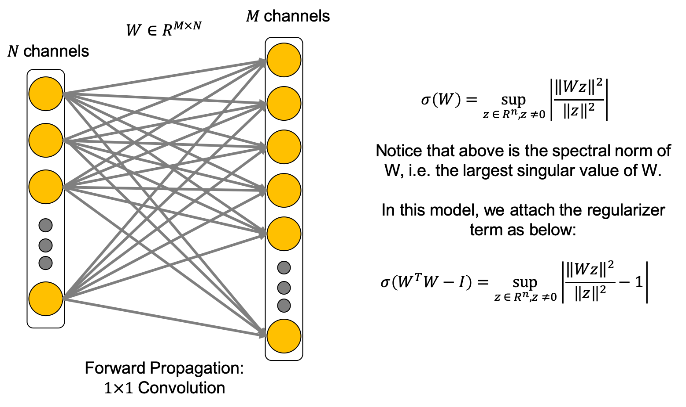
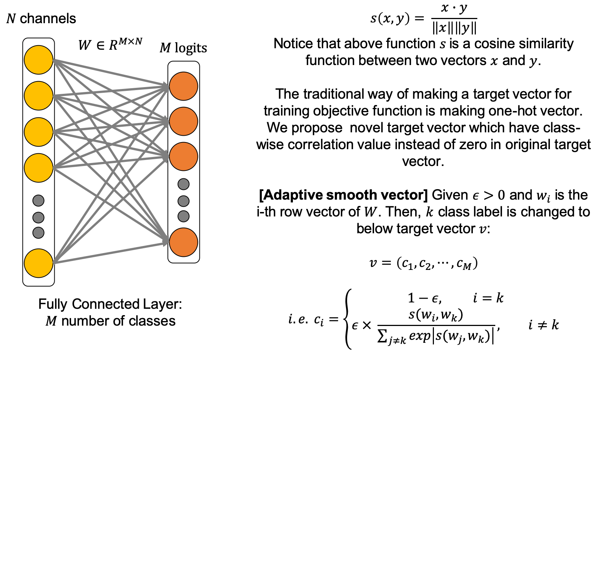
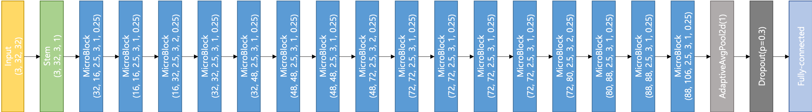
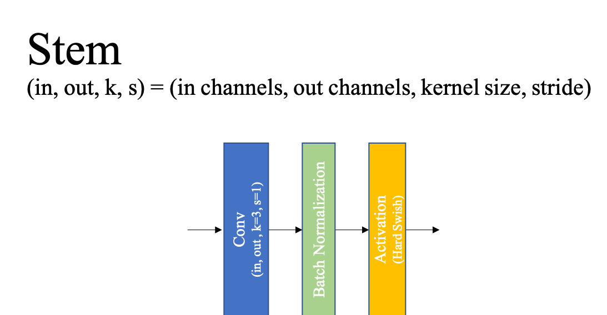
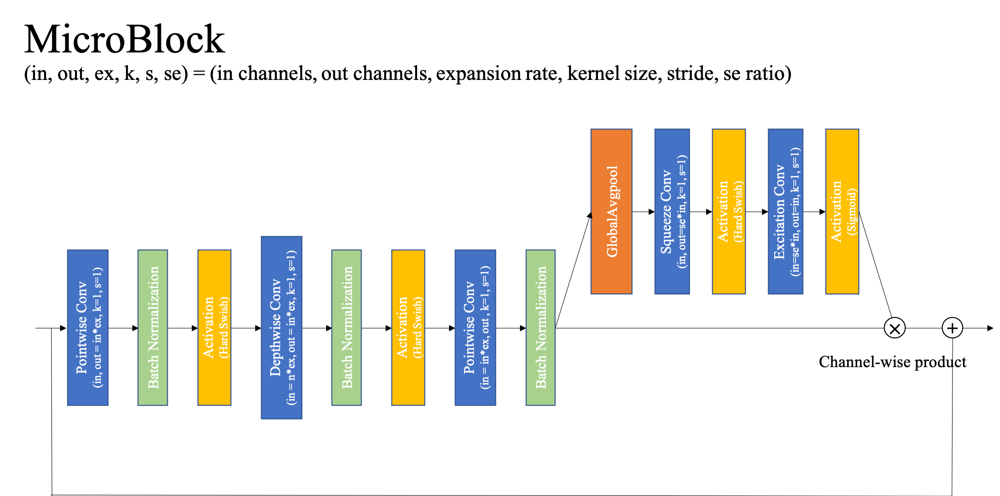
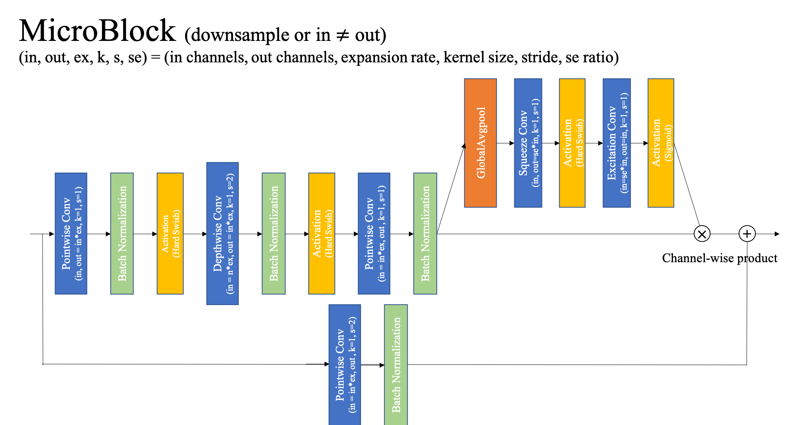

# Our Contribution
We proceed this work through [PMLR Volume123](http://proceedings.mlr.press/v123/kim20a.html)(Proceedings of the NeurIPS 2019 Competition and Demonstration Track, PMLR 123:13-26, 2020). The paper title is `Efficient Model for Image Classification With Regularization Tricks`. Our main contributions are divided into four parts.

## 1. **Orthonormal regularization**

From previous works, dynamic isometric property increases the network performance, but actually the gain from previous orthonormal regularizer is minuscule. We found that attaching the orthonormal regularizer only on 1x1 convolution increases remarkable amounts in the performance, and we argue that this is very related to feature map space.



It is termed as the Spectral Restricted Isometry Property (SRIP) regularization. ([Bansal et al., 2018](https://arxiv.org/abs/1810.09102))

## 2. **Initialization**

Many networks are initialized with Kaiming initialization or Xavier initialization, but the weights of converged networks are very far from the intial weight distribution. From the empirical results, we found that with our method, trained weight distribution are always certain. Therefore, we initialized  our networks with this obtained weight distribution.

## 3. **Weighted label smooth loss function**

The most well-known loss function in convolutional neural networks is Cross-Entropy loss. In the recent, label smooth function can not only enhance the robustness, but also increase the performance so that many replace the loss function as label smooth.  However, this method doesn’t deal with the class-correlation, so sometimes the network is not well-trained when increasing the epsilon. In our loss function called weighted label smooth loss function, this distributes the epsilon with considering class-correlation. The key idea of scaling the class-relativity is to score the weight as the cosine similarity with the class representative feature vector from fully-connected layers’s i-th row vector.



## 4. **Prune with iterative training**

Recently, iterative pruning with lottery ticket hypothesis is one of the state-of-art pruning method. However, here, we found that keeping pretrained weight, not using random-init, is a bit beneficial for network, and increasing the pruning rate with linear scheduling can preserve the performance. For instance, if you want to prune 50% of the pretrained network weights, then train the pruned network 4 times with pruned rate as 12.5%, 25.0%, 37.5%, and 50%. Then, you could train the 50% pruned network without accuracy loss.

# Method

## 1. Data Augmentation

#### I. [Fast AutoAugmentation](https://arxiv.org/abs/1905.00397) [Lim et al., 2019]

We use fast autoaugmentation of CIFAR100, which is made from the networks, wide-resnet and densenet. We can get the CIFAR100 Fast Autoaugmentation strategies from the authors of above paper.

## 2. Network Structure

We use several blocks, layers, and activation that are known to be efficient in our MicroNet network. These are listed as follow.

#### I. [SE Block](https://arxiv.org/abs/1709.01507) [Hu et al., 2017]

We attach the Squeeze-and-Excitation (SE) block at the end of the each block in network. Normalizing the input only with batch normalization is a bit hard, but with SE block, it plays a role as scaling factor of covariate shift.


#### II. [Inverted Residual Block](https://arxiv.org/abs/1801.04381) [Sandler et al., 2018]

Inverted residual block was first introduced in MobileNetV2 model. This block becomes basic structure of following networks such as [MnasNet](http://arxiv.org/abs/1807.11626), [EfficientNet](http://arxiv.org/abs/1905.11946), [MobileNetV3](https://arxiv.org/abs/1905.02244). Our network is based on MobileNetV3 architecture, so our model, of course, follows inverted residual block structure.

#### III. [HSwish activation](https://arxiv.org/abs/1905.02244) [Howard et al., 2019]

Hard swish (HSwish) activation was introduced in Searching for [MobileNetV3](https://arxiv.org/abs/1905.02244) from Google. Hswish function is defined as follow.


We incorporated this activation function in our model for better accuracy.

#### IV. [Batch Normalization](https://arxiv.org/abs/1502.03167) [Ioffe et al., 2015]

To solve the internal covariate shift, we add the batch normalization between each convolution and activation function, and empirically, we found using batch normalization generalizes better.

## 3. Network Training

#### I. [Orthonormal Regularization](https://arxiv.org/abs/1810.09102) [Bansal et al., 2018]

We use the orthonormal regularization (Spectral Restricted Isometry Property Regularization from above work) on pointwise convolution layer, not on depthwise convolution layer. To orthogonalize the weight matrix, one of the efficient way is to regularize the singular value of the matrix. However, this cause a lot of computation costs so that we use an approximated method called SRIP similar with RIP method. In ours, we add this regularizer with $10^{-2}$ coefficient.

#### II. [Cosine Annealing Scheduler](https://arxiv.org/abs/1608.03983) [Loshchilov et al., 2016]

We use the cosine annealing function as the learning rate scheduler. Converging to local optima is well-known issue in training deep neural network. We found that the periodic function can solve this issue with high probability, and from the empirical results, the output network generalizes better than others.
(i.e. also, if you want other periodic function, you can use it and we check the step decay function can replace this consine annealing scheduler.)

## 4. Network Regularization

#### I. [Cutmix](https://arxiv.org/abs/1905.04899) [Yun et al., 2019]

For better generalization in data augementation policy, we apply `CutMix` regularization which outperfroms other state-of-the-art methods. This method enables that the network have the effects from both a regional dropout stategy and a mixup stategy. 


#### II. [Weight decay](https://papers.nips.cc/paper/563-a-simple-weight-decay-can-impro) [Krogh et al., 1991]

To prevent the overfitting of deep learning model, we need to use regularization method. One of kind regularization method is the weight decay which is to penalize weights proportionally to their magnitude to prevent overfitting during trainnig. However, when model is quite small like compressed model, weight decay aggravate the training performance. Therfore, we use a little bit small weight decay and for version1 network, we did not apply weight decay on the parameters of batch normalization.

#### III. [Momentum](https://www.cs.toronto.edu/~fritz/absps/momentum.pdf) [Sutskever et al., 2013]

Gradient descent is very important to train deep neural network. However, conventional GD is easily stuck in local optimum. Therefore, there are many gradient descent optimization algorithms to address it. Recently, SGD is commonly used and enough to train deep learning model with momentum. The momentum helps to converge better by preventing stuck to local optima when gradient descent. Therefore, we use SGD optimizer with momentum.

## 5. Pruning

#### I. [Lottery Ticket Hypothesis](https://arxiv.org/abs/1803.03635) [Frankle et al., 2018]

[Han et al., 2015] suggested deep learning pruning method based on magnitude very well. But, this conventional pruning method has very critical weakness which is the too many re-training process. To address it, [Frankle et al., 2019] defines the lottery ticket hypothesis which is that A randomly-initialized, dense-neural networks contain subnetworks called winning tickets. Here, winning ticket can reach the comparable test acuuracy in at most same iteration of original netwrok through re-initialization right before re-training process. As lottery ticket is a very recent powerful pruning method, we prune the network almost same with this method except for random initialization.

# Reproduce

## 1. Network Overview
```
Stem : (in channels, out channels, kernel size, stride)
MicroBlock : (in channels, out channels, expansion rate, kernel size, stride, se ratio)
```
We made two types of micronet. They are slightly different and the overview of network is like below.
#### Network version 1

#### Network version 2


## 2. Network Blocks




Our network blocks are divided into two, stem block and mobile block.
When downsampling the layer-wise input, we use the depthwise kernel size as 2 and attach the 1x1 convolution block at the shortcut.

## 3. Training Procedure

```
Scheduler: Cosine annealing function
Initial lr: 0.1
Minimum lr: 0.0005
Weight decay: 1e-5
Momentum: 0.9 (on batchnorm, we use 0.99)
Nesterov: True
Epoch: 600
Period T: 150
Orthonormal coefficient: 0.7
Data: CIFAR100 with fast autoaugmentation
Batch weight decay: True
Batch size: 128
Cutmix alpha: 1
loss function: weighted labelsmooth function (ours)
```

## 4. Code Implementation
To get our pruned micronet, you go through 2 steps: I. Smooth Signal propagation, II. Iterative lottery ticket prune.

#### I. Smooth Signal propagation
To reproduce our network as version 1, run:

```
python3 micronet_main.py --model=micronet --dataset=CIFAR100 --lr=0.1 --batch_size=128 --lr_type=cos --n_epoch=600 --input_regularize=cutmix --label_regularization=crossentropy --name=micronet_reproduce --ortho_lr=0.7 --model_ver=ver1 --progress_name=reproduce_progress --batch_wd=False
```


To reproduce our network as version 2, run:

```
python3 micronet_main.py --model=micronet --dataset=CIFAR100 --lr=0.1 --batch_size=128 --lr_type=cos --n_epoch=600 --input_regularize=cutmix --label_regularization=crossentropy --name=micronet_reproduce --ortho_lr=0.7 --model_ver=ver2 --progress_name=reproduce_progress
```

#### II. Iterative lottery ticket prune
First of all, you should load the parameters from the step I network (name: micronet_ver_test), and then execute the code with your desired prune rate. We get the network with 45% prune rate.

#### ver1
```
python3 micronet_main.py --model=micronet_prune --dataset=CIFAR100 --lr=0.1 --batch_size=128 --lr_type=cos --n_epoch=600 --input_regularize=cutmix --label_regularization=crossentropy --name=micronet_reproduce_pr1 --ortho_lr=0.7 --max_prune_rate=45. --load_name=micronet_reproduce --model_ver=ver1 --batch_wd=False
```

And after training above, run prune-training once again:
```
python3 micronet_main.py --model=micronet_prune --dataset=CIFAR100 --lr=0.1 --batch_size=128 --lr_type=cos --n_epoch=600 --input_regularize=cutmix --label_regularization=crossentropy --name=micronet_reproduce_pr2 --ortho_lr=0.7 --min_prune_rate=45. --max_prune_rate=65. --load_name=micronet_reproduce_pr1 --model_ver=ver1 --batch_wd=False
```


#### ver2
```
python3 micronet_main.py --model=micronet_prune --dataset=CIFAR100 --lr=0.1 --batch_size=128 --lr_type=cos --n_epoch=600 --input_regularize=cutmix --label_regularization=crossentropy --name=micronet_reproduce_pr1 --ortho_lr=0.7 --max_prune_rate=45. --load_name=micronet_reproduce --model_ver=ver2
```

And after training above, run prune-training once again:
```
python3 micronet_main.py --model=micronet_prune --dataset=CIFAR100 --lr=0.1 --batch_size=128 --lr_type=cos --n_epoch=600 --input_regularize=cutmix --label_regularization=crossentropy --name=micronet_reproduce_pr2 --ortho_lr=0.7 --min_prune_rate=45. --max_prune_rate=65. --load_name=micronet_reproduce_pr1 --model_ver=ver2
```

After this, you may get the final checkpoints which have the accuracy higher than 80% with 65% pruning.

## 5. FLOPs

We refer to ‘thop’ library source from [here](https://github.com/Lyken17/pytorch-OpCounter) to count the add operations and multiplication operations. However, to keep the rules of (Neurips 19’s)  micronet challenge, we change many parts of the counting functions. In code, addition is counted 3 and multiplication is counted 1 for the relu6 operations. This is because ReLU6 is only used in hard swish function so that this counting policy is actually for hard swish function when counting the operations of our network.

Details about score method, we deal with it in the jupyter notebooke file `Score_MicroNet.ipynb`.


Thank you for reading.

## Dependencies

Current code base is tested under following environment:

1. Python 3.7.3
2. PyTorch 1.1.0
3. torchvision 0.3.0
4. Numpy 1.16.2
5. tqdm

# Member
* Taehyeon Kim
* Jonghyup Kim
* Changhwan Kim

## Contact

To contact us:

Tae hyeon Kim, potter32@kaist.ac.kr

## Acknowledgement

This work was supported by Institute for Information & Communications Technology Promotion (IITP) grant funded by the Korea government (MSIT) [No.2018-0-00278,Development of Big Data Edge Analytics SW Technology for Load Balancing and Active Timely Response].
